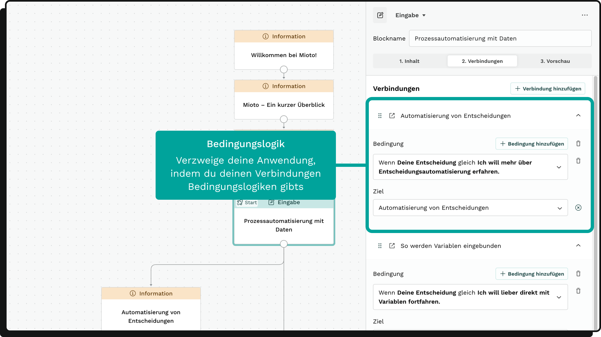

### Einleitung

Mit Mioto lassen sich Entscheidungsprozesse durch interaktive Entscheidungsbäume automatisieren und strukturieren. In diesem Artikel erfährst du, wie du Blöcke verbinden und Verbindungen mit Bedingungen versehen kannst.

### Verbindungen erstellen

Verbindungen können auf zwei Arten erstellt werden:

* Canvas-Methode: Klicke auf den Port eines Blocks und ziehe die Verbindung zu einem anderen Block oder lasse sie auf dem leeren Canvas los, um einen neuen Block zu erstellen.
* Editor-Methode: Gehe zum Verbindungstab im Block-Editor und füge eine neue Verbindung hinzu. Wähle ein Verbindungsziel, das entweder ein bestehender oder ein neu zu erstellender Block sein kann.

### Bedingungen festlegen

Im Verbindungstab kannst du die Bedingungen für jede Verbindung festlegen. Beispiel:

"Wenn die Frage mit 'Ja' beantwortet wird, gehe zu Block X."

Hinweis: Ohne Bedingungen kann sich der Entscheidungsbaum nicht verzweigen.

### Bedingungssätze

Ein Bedingungssatz besteht aus:

* einer Variable
* einem Vergleichsoperator
* einem Vergleichswert

Verfügbare Vergleichsoperatoren:

* Einfachauswahl: ist gleich, ist ungleich
* Mehrfachauswahl: ist gleich, ist ungleich
* Zahl: ist gleich, ist ungleich, ist größer, ist kleiner, ist größer/gleich, ist kleiner/gleich
* Block-Status: ist aktiviert, ist nicht aktiviert

### Komplexe Bedingungen

* Verkettete Bedingungssätze: Hier können Bedingungssätze mit UND oder ODER verkettet werden.
* Logik: Mit UND müssen alle Bedingungen zutreffen; mit ODER muss mindestens eine zutreffen.

### Reihenfolge der Bedingungen

Die Reihenfolge im Verbindungstab ist entscheidend für die Prüfung der Bedingungen. Verbindungen werden von oben nach unten geprüft.

### Spezialverbindungen

* Direktverbindung: Wenn nur eine Ausgangsverbindung existiert, wird diese automatisch zur Direktverbindung. Sie benötigt keine Bedingungen.
* Rückfallverbindung: Diese Verbindung wird aktiviert, falls keine der anderen Verbindungen zutrifft. Sie steht immer am Ende der Liste und sorgt dafür, dass der Prozess immer fortgeführt wird.
