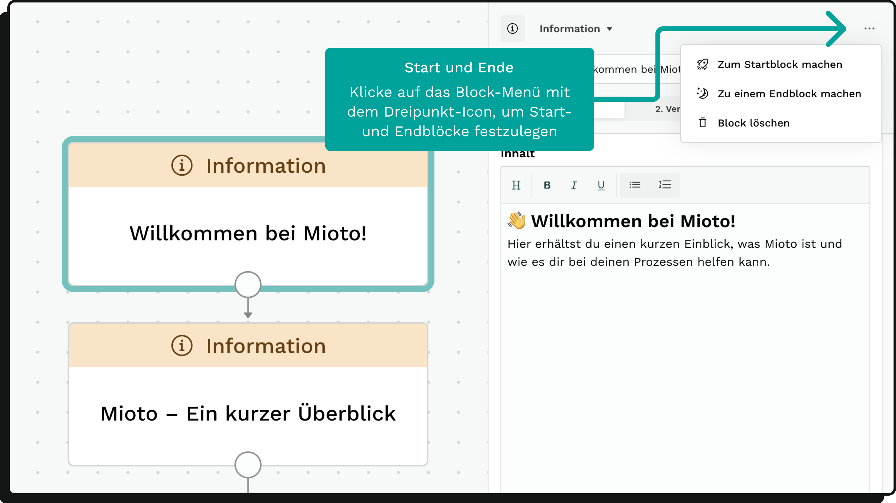

### Einleitung

Blöcke sind die Kernkomponenten jeder Anwendung und dienen als Grundbausteine für verschiedene Aktionen, die deine Anwendung durchführen kann. Sie können Fragen stellen, Daten sammeln und austauschen oder Dokumente generieren.

### Blöcke erstellen

Es gibt zwei Hauptmethoden, um einen neuen Block zu erstellen:

* Plus-Button: Klicke auf den Plus-Button in der linken Seitenleiste. Danach wählst du den Blocktyp aus.
* Verbindungskreis: Wenn bereits ein Block vorhanden ist, kannst du am Verbindungskreis dieses Blocks ziehen und die Verbindung auf dem Canvas loslassen. Die Auswahl eines Blocktyps erscheint und nach der Auswahl wird der neue Block direkt mit dem vorhandenen Block verbunden.

### Blöcke auf dem Canvas

Blöcke werden auf dem Canvas als Karten repräsentiert und enthalten folgende Elemente:

* Start- und Endlabel: Nur bei Start- oder Endblöcken vorhanden (Kopfzeile der Blockkarte)
* Blocktyp: Dargestellt in der Kopfzeile der Blockkarte
* Blockname: In der Mitte der Blockkarte angezeigt

Blöcke besitzen einen Verbindungskreis, von dem aus per Drag-and-drop Verbindungen zu anderen Blöcken hergestellt werden können.

#### Kopfzeile des Block-Editors

In der Kopfzeile des Editors gibt es verschiedene Optionen:

* Button zum Ändern des Blocktyps
* Eingabefeld für den Blocknamen
* Blockmenü
* Tabs für verschiedene Ansichten (Blockinhalt, Verbindungen, Formular-Vorschau bei formularseitigen Blöcken)

##### Block-Menü

Das Block-Menü öffnet sich, wenn du auf das Dreipunkt-Icon in der Kopfzeile des Block-Editors klickst. Hier hast du die Möglichkeit:

* Start- und Endblock festlegen: Jede Anwendung muss einen Startblock und mindestens einen Endblock haben.
  * Startblock: Gekennzeichnet durch ein Raketen-Icon, stellt den Anfang des Entscheidungsbaums dar.
  * Endblock: Verhindert das Erscheinen eines "Zum nächsten Schritt"-Buttons in der fertigen Anwendung.

Start- und Endblöcke werden im Block-Menü des Block-Editors festgelegt.

* **Block duplizieren: **Dupliziert den Block mitsamt Inhalt, aber ohne dessen Verbindungen.
* **Block löschen: **Löscht den Block mitsamt Verbindungen bei Bestätigung des Dialogs.

### Block-Editor

Klickst du auf eine Blockkarte, öffnet sich der zugehörige Block-Editor in der rechten Seitenleiste. Hier kannst du:

* Spezifische Einstellungen vornehmen
* Verbindungen zwischen Blöcken definieren

### Blocktypen und ihre Funktionen

Es gibt verschiedene Blocktypen. Jeder Blocktyp hat eine eigene Funktion, die in den Entscheidungsbaum integriert werden kann. Blocktypen sind wiederum in verschiedene Kategorien sortiert.

#### Daten

Datenblöcke produzieren Daten, die als Variablen im Text, oder in der Entscheidungslogik des Entscheidungsbaums verwendet werden können.

Datenblöcke sind Blöcke des Typs:

* [Eingabe](https://miotodocs.netlify.app/docs/Blocktyp-Eingabe "")
* [Berechnung](https://miotodocs.netlify.app/docs/Blocktyp-Berechnung "")
* [Textblock](https://miotodocs.netlify.app/docs/Blocktyp-Textblock "")

#### Aktionen

Aktionsblöcke führen Aktionen im Hintergrund der Anwendung aus.

Aktionsblöcke sind Blöcke des Typs:

* [E-Mail](https://miotodocs.netlify.app/docs/Blocktyp-E-Mail "")
* [Dokument](https://miotodocs.netlify.app/docs/Blocktyp-Dokument "")

#### Struktur

Strukturblöcke dienen zur Strukturierung der Anwendung.

Strukturblöcke sind Blöcke des Typs:

* [Logik](https://miotodocs.netlify.app/docs/Blocktyp-Logik "")
* [Information](https://miotodocs.netlify.app/docs/Blocktyp-Information "")
