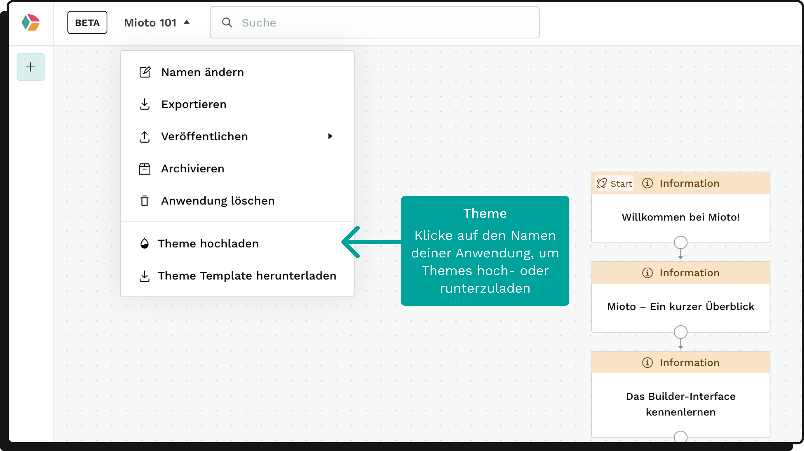

Mit Mioto kannst du die Optik deines Formulars individuell gestalten.

### Zugang zum Projektmenü

Deine Anpassungen nimmst du im Projektmenü vor. Öffne es, indem du im Builder oben links auf den Projektnamen klickst.

Im Projektmenü hast du die Möglichkeit, ein eigenes Theme hochzuladen und unser vorbereitetes Theme Template herunterzuladen.



### Theme Template

Das heruntergeladene Theme Template öffnest du am besten in einem Code Editor (zum Beispiel Visual Studio Code). Es listet sämtliche von Mioto verwendeten Styles auf.

Besonders wichtig sind hierbei die zwölf primary-Werte, die zum Beispiel die Farben der Buttons festlegen.

### Anpassung der Werte

Um die Farbwerte anzupassen, trage die gewünschten Werte an der entsprechenden Stelle im Template ein. Wenn du das angepasste Template hochlädst, überschreiben diese Werte die Standard-Einstellungen in deiner Anwendung.

Das Ergebnis deiner Anpassungen kannst du in der Vorschau betrachten.

Die Farbwerte sollten im HSL-Format gespeichert werden. Ein beispielhafter Eintrag könnte so aussehen:

```
"colors-primary9": "343.4 96.6% 45.5%"
```

Bitte beachte, dass du in diesem Format bleibst - also keine Klammern und Kommata benutzt.

Möchtest du mehr über das HSL-Format erfahren, kannst du [hier nachlesen](https://cloudfour.com/thinks/hsl-a-color-format-for-humans/ "").

Einen Konverter für deine Hex-Codes findest du [hier](https://htmlcolors.com/hex-to-hsl "").

### Farbnuancen und schnelle Anpassungen

Ideal wäre es, wenn du deine Farben in 12 Nuancen bereit hast, sodass du alle 12 Werte der jeweiligen Farbe ersetzen kannst.

Als praktische Lösung solltest du mindestens die folgenden Primary-Werte ändern:

* Primary 3, 4, 5 und 11 für Buttons
* Primary 5 für Active State Inputs
* Primary 9 für Single Select
* Primary 9 und 10 für Multi Select

### Cache-Hinweis

Bei mehrfachen Änderungen am Theme kann es sein, dass die Vorschau die Änderungen nicht direkt anzeigt. In diesem Fall könnte es sein, dass dein Browser das alte Theme noch im Cache hat.

Leere in diesem Fall den Cache und lade die Seite neu. Anleitungen dazu findest du für deinen spezifischen Browser im Internet.
