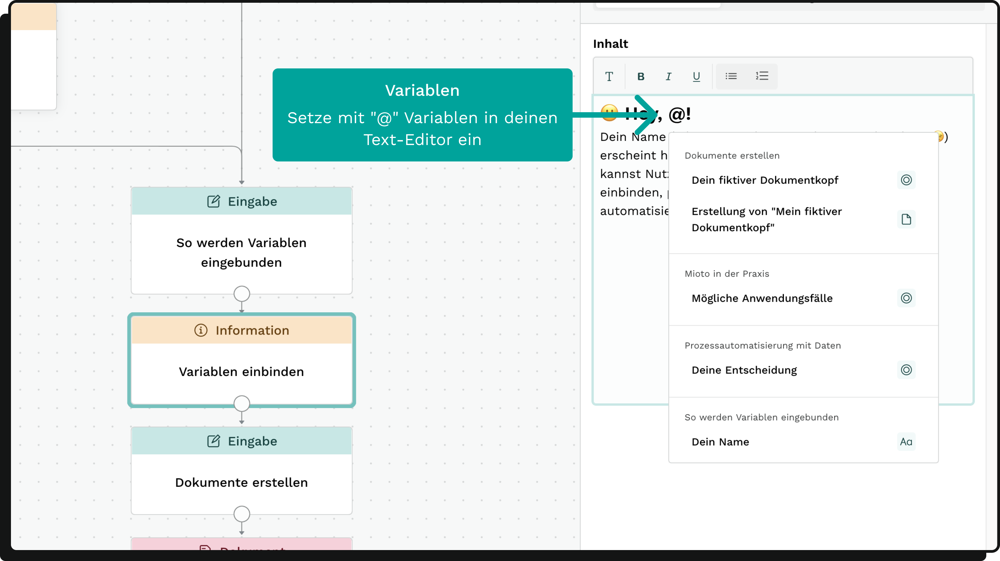

### Was sind Variablen?

Variablen sind spezielle Platzhalter für Werte, die dynamisch während der Nutzung eines Formulars generiert werden. Sie stehen für die unterschiedlichen Eingaben der Nutzer/innen und erlauben die Erstellung von individuell zugeschnittenen Texten, Dokumenten und Aktionen.

### Woher kommen Variablen?

Variablen werden in verschiedenen Kontexten erzeugt:

* Eingabe-Blöcke: Jede Nutzereingabe in einem Eingabe-Block erzeugt eine neue Variable.
* Berechnungs-Blöcke: Das Ergebnis des Berechnungsblocks wird als Variable gespeichert.
* Textblöcke: Der Textinhalt des Textblocks wird als Variable erzeugt.
* Block-Status: Jeder Block erzeugt eine Statusvariable, die verfolgt, ob der Block im Entscheidungsbaum aktiviert wurde oder nicht.

### Variablentypen

Es gibt verschiedene Arten von Variablen, und die Art der Variable beeinflusst, wie sie in Bedingungssätzen verwendet werden kann:

* Einfachauswahl: Erzeugt durch die "Einfachauswahl"-Eingabe.
* Mehrfachauswahl: Erzeugt durch die "Mehrfachauswahl"-Eingabe.
* Text: Erzeugt durch "Texteingabe" oder "Textfeld"-Eingabe.
* Zahl: Erzeugt durch "Zahleneingabe".
* Block-Status: Erzeugt durch den Status eines Blocks.

Icon-Hinweis: Jeder Variablentyp hat ein eigenes Icon, das neben der Variable angezeigt wird. Blockstatus-Variablen behalten das Icon des jeweiligen Blocktyps.

### Einsatz von Variablen in deiner Anwendung

#### Integration in Dokumente

Für Informationen zur Einbindung von Variablen in Dokumente siehe: [Dokumente automatisieren](https://miotodocs.netlify.app/docs/dokumente "").

#### Integration in den Texteditor

Variablen können leicht in den Texteditor von Informations-, Report- und Eingabe-Blöcken integriert werden. Hier ist, wie es geht:

* Drücke das @-Symbol auf deiner Tastatur.
* Eine Dropdown-Liste mit allen verfügbaren Variablen wird angezeigt.
* Wähle die gewünschte Variable aus, und sie wird nahtlos in deinen Text eingefügt.

