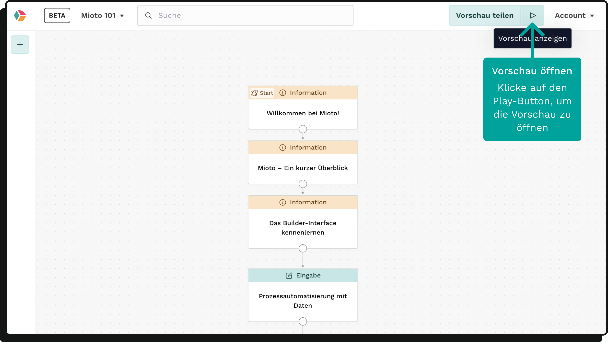
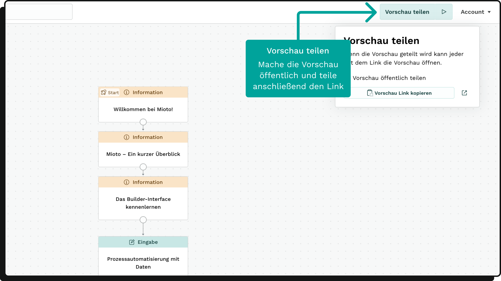

Während der Erstellung der Anwendung kannst du den aktuellen Stand begutachten.

### Anwendungsvorschau

Im Editor kannst der Live-Stand der Anwendung über die Vorschau eingesehen werden.

Klicke dazu in der Kopfzeile des Builders auf den Play-Button.

### Öffentliche Vorschau

Du hast zudem die Möglichkeit zu entscheiden, ob die Vorschau deiner Anwendung öffentlich gemacht wird. Klicke hierzu auf den Button *Vorschau teilen*.

