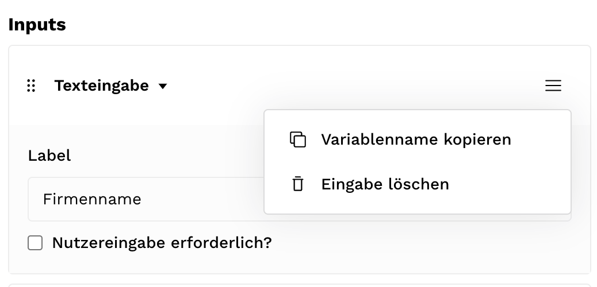

### Allgemeines

In Dokumententemplates können sämtliche Variablen referenziert werden, die in der Mioto-Anwendung produziert werden.

Die Referenzierung erfolgt über eine Template-Sprache, die durch geschweifte Klammern ausgedrückt wird. Wenn ein Dokument generiert wird, läuft die Software über das Template, erkennt diese Sprache und ersetzt diese.

Ein Absatz im Word-Dokument könnte so aussehen:

```
{Abfrage.Vor_und_Nachname}, wohnhaft in {Abfrage.Wohnort} hat innerhalb von 14 Tagen die Zahlung auf das Konto mit der IBAN {Abfrage.IBAN_des_Empfaengers} zu leisten.
```

Das übrige Word-Dokument wird von unserer Software nicht beeinflusst. Du kannst das Template also beliebig stylen und formatieren - wie etwa dein eigenes Logo verwenden.

Die Template-Sprache bietet nicht nur die Möglichkeit, Variablen einzusetzen. Es gibt auch die Möglichkeit, if-Bedingungen zu verwenden. Beispielsweise: Wenn diese Variable vorliegt, füge diesen Absatz ein.

### Variablen aus dem Builder kopieren

Die Variablen können im Builder am Ort, wo sie erzeugt werden, kopiert werden. Nutzer:inneneingaben können im jeweiligen Eingabe-Block referenziert werden (siehe Bild).




### Einbinden von Variablen

Die Variable kann jetzt im Word-Dokument durch strg/cmd + v (oder Rechtsklick → Einfügen) an beliebiger Stelle eingefügt werden.

Der eingesetzte Wert wird bei der Generierung dasselbe Styling haben, wie die Variable. Formatierst du den eingesetzten Text Fett und auf Schriftgröße 6, wird so auch der eingesetzte Wert von der Anwendung generiert.

Die Referenzierung erfolgt derzeit über den Blocknamen und das Label der Eingabe. Beides sollte deshalb nicht mehr im Builder geändert werden, sobald die Variable in einem Dokument verwendet wird. In einer zukünftigen Version von Mioto werden wir dieses Problem adressieren.

Wenn für eine Variable kein Wert von der Nutzer:in eingegeben wurde, wird der Platzhalter “#####” eingesetzt. Um das zu verhindern, können if-Bedingungen verwendet werden.

### if-Bedingungen: wenn Variable exisitiert

Variablen können auch als if-Bedingungen verwendet werden. Dafür muss nach der geschweiften Klammer ein # oder ^ eingesetzt werden. Die if-Bedingung wird geschlossen, indem ein / hinter die geschweifte Klammer gesetzt wird

Mit dieser Schreibweise wird ein Wert nur dann eingesetzt, wenn er auch abgefragt wurde. Wenn der Wert nicht vorhanden ist, wird nichts im Text eingesetzt:

```
{#Abfrage.Vor_und_Nachname}
Die Person heißt {Abfrage.Vor_und_Nachname}.
{/Abfrage.Vor_und_Nachname}
```

Auf diese Weise wird der Text "Die Person heißt Max Mustermann." in das Dokument eingesetzt, wenn das Feld "Vor-und Nachname" im Block "Abfrage" NICHT ausgefüllt wurde:

```
{^Abfrage.Vor_und_Nachname}
Die Person heißt Max Mustermann.
{/Abfrage.Vor_und_Nachname}
```

### Weiterführende if-Bedingungen

If-Bedingungen können auch überprüfen, ob eine Variable auf einen bestimmten Wert gesetzt wurde:

```
{#Ueberpruefung.Datenschutzhinweis == "Ja"}
Auf die Datenschutzerklärung wird hingewiesen.
{/}
```

oder

```
{#Streitwert.Berechnung > 5000}
Landgericht
{/}
{#Streitwert.Berechnung <= 5000}
Amtsgericht
{/}
```

Die folgenden Operatoren werden unterstützt: == != >= > <= <

Achtung. Hier sind drei Fallstricke zu beachten:

1. Die if-Bedingung wird hier anders geschlossen (durch ein / in geschweiften Klammern).

2. Die Antwort (hier "Ja") muss in geraden Anführungszeichen (wie im Beispiel) eingesetzt werden. Word ändert diese häufig automatisch in typographische Anführungszeichen. Dies kann so deaktiviert werden: [https://support.microsoft.com/de-de/office/intelligente-anführungszeichen-in-word-702fc92e-b723-4e3d-b2cc-71dedaf2f343](https://support.microsoft.com/de-de/office/intelligente-anf%C3%BChrungszeichen-in-word-702fc92e-b723-4e3d-b2cc-71dedaf2f343 "")

3. Zahlenwerte werden ohne Anführungszeichen eingesetzt.

### Mehrfachauswahl

Bei Mehrfachauswahl-Abfragen ist vorher nicht klar, wie viele Angaben Nutzer:innen machen werden. Wir müssen also damit umgehen, dass keine, eine oder mehrere Angaben gemacht werden.

Die Template-Sprache dafür könnte so aussehen:

```
{#Erbrachte_Leistungen.Leistungen.length > 0}
Die Haftung wird ausgeschlossen für
{/}
{#Erbrachte_Leistungen.Leistungen}
- {.}
{/Erbrachte_Leistungen.Leistungen}
```

Zunächst wird überprüft, ob es überhaupt Antworten gab. Wenn mindestens eine Antwort gegeben wurde, wird ein einleitender Satz hinzugefügt. Hierfür wird die length-Eigenschaft überprüft, indem hinter die Variable .length eingesetzt wird. *Blockname.Mehrfachauswahl.length* ist gleich der Anzahl der ausgewählten Antworten der Mehrfachauswahl. Dies funktioniert nur bei Mehrfachauswahl-Variablen. Für Fortgeschrittene: Gegebene Mehrfachauswahl-Antworten werden als Array gespeichert.

Gibt es Antworten (ist die "length" des Antwortspeichers über 0), wird der Absatz hinzugefügt.

Die if-Bedingung wird durch *{/}* geschlossen.

Nun wird über die einzelnen Antworten geloopt. Jede gegebene Antwort wird in den Format von {.} ausgegeben - hier also als Strichliste. Wenn keine Antworten gegeben wurden, wird auch nichts ausgegeben.

Schließlich wird der Loop durch *{/Erbrachte_Leistungen.Leistungen}* geschlossen.

---

Innerhalb des Loops können die Variablen der Mehrfachauswahl auch in if-Bedingungen überprüft werden. So ist es möglich, die Variablen (=Antworten) nicht nur wiederzugeben, sondern je nach gegebenen Antworten Absätze dynamisch einzusetzen.

Mit *Blockname.Eingabename[$index]* werden die Antworten der Mehrfachauswahl referenziert.

```
{#Sonstiges.Bestimmungen}
{#Sonstiges.Bestimmungen[$index] == "Kommunikation"}
Kommunikation
Lorem ipsum dolor sit amet, consectetur adipiscing elit, sed do eiusmod tempor incididunt ut labore et dolore magna aliqua.
{/}
{#Sonstiges.Bestimmungen[$index] == "Non Disclosure"}
Geheimhaltung
Lorem ipsum dolor sit amet, consectetur adipiscing elit, sed do eiusmod tempor incididunt ut labore et dolore magna aliqua.
{/}
{#Sonstiges.Bestimmungen[$index] == "Haftungsausschluss"}
Haftungsausschluss
Lorem ipsum dolor sit amet, consectetur adipiscing elit, sed do eiusmod tempor incididunt ut labore et dolore magna aliqua.
{/}
{/Sonstiges.Bestimmungen}
```

Gehen wir davon aus, dass bei der Eingabe *Bestimmungen* im Block *Sonstiges* die Antworten *Kommunikation* und *Haftungsausschluss* ausgewählt wurden.

Die gespeicherten Daten für Fortgeschrittene: "Sonstiges": {"Bestimmungen": ["Kommunikation", "Haftungsausschluss"]}

Im Word-Template passiert nun folgendes:
* *Sonstiges.Bestimmungen* existiert, deshalb wird der Inhalt der äußeren Klammer (von *{#Sonstiges.Bestimmungen}* bis *{/Sonstiges.Bestimmungen}*) ausgeführt. Weil es sich um Mehrfachauswahl-Antworten handelt, wird mehrfach über den Inhalt geloopt.
* Die Anwendung loopt nun das erste Mal über *Sonstiges.Bestimmungen*. *Blockname.Eingabename[$index]* enthält nun die erste der Mehrfach-Antworten ("Kommunikation"). Die erste der drei Bedingungen im Loop trifft zu, deshalb wird der Absatz zum Kommunikation eingesetzt.
* Die Anwendung loopt das zweite Mal über *Sonstiges.Bestimmungen*. *Blockname.Eingabename[$index]* enthält die zweite der Mehrfach-Antworten "Haftungsausschluss". Die dritte der drei Bedingungen im Loop trifft zu, deshalb wird der Absatz zum Haftungsausschluss eingesetzt.

Im generierten Word Dokument steht nun:

Kommunikation

Lorem ipsum dolor sit amet, consectetur adipiscing elit, sed do eiusmod tempor incididunt ut labore et dolore magna aliqua.


Haftungsausschluss

Lorem ipsum dolor sit amet, consectetur adipiscing elit, sed do eiusmod tempor incididunt ut labore et dolore magna aliqua.

---

Hier kannst du eine Mioto-Anwendung herunterladen, die alle hier gezeigten Beispiele enthält:

[Anwendung downloaden](../../public/examples/doc-starter.zip)

