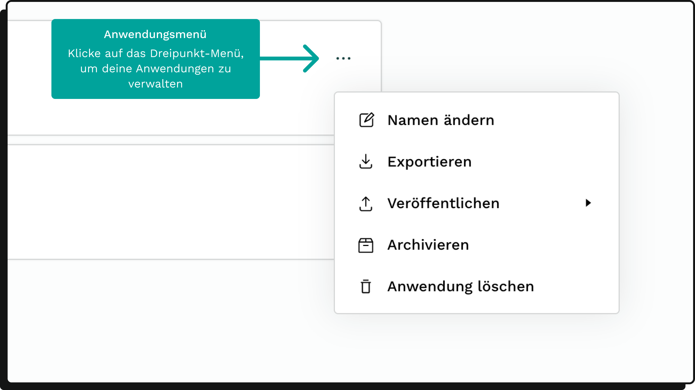

### Was sind Mioto-Anwendungen?

#### Einleitung

Mioto-Anwendungen sind interaktive Formulare, mit denen du Daten sammeln und Abläufe automatisieren kannst. Der Aufbau erfolgt im Mioto Builder als Entscheidungsbaum.

#### Anwendungsbeispiele im juristischen Bereich:

* Interaktive FAQ-Kataloge: Automatisierung von Compliance-Anfragen, Weiterleitung an Sachbearbeiter nur bei Bedarf.
* Vertragsgeneratoren: Erstellung maßgeschneiderter Verträge.
* Interaktive Leitfäden: Unterstützung im Rahmen eines Mandats.

***

### Anwendungen erstellen und importieren

#### Erstellung einer neuen Anwendung

1. Gehe zur Seite "Meine Anwendungen".
2. Klicke auf den Button "Anwendung erstellen".
3. Gib der neuen Anwendung einen Namen.
4. Der Builder wird automatisch geöffnet.

#### Anwendungen importieren

* Export und Import sind als json-Datei möglich.
* Hinweis: Word-Templates sind derzeit nicht im Export/Import enthalten und müssen separat importiert/exportiert werden.

***

### Anwendungen suchen und filtern

#### Suchleiste

* Einfach den Namen der Anwendung eingeben.
* Wenn du sie nicht findest, prüfe, ob ein Filter aktiv ist.

#### Filteroptionen

* Veröffentlicht
* Archiv

Hinweis: Archivierte Anwendungen sind nur sichtbar, wenn der Archiv-Filter aktiviert ist.

#### Sortierung

* Zuletzt bearbeitet
* Erstellungsdatum
* Aufsteigend/Absteigend

***

### Anwendungen verwalten

#### Anwendungs-Menü

Dieses Menü findest du an zwei Stellen:

* Als Dreipunkt-Menü auf der Karte in "Meine Anwendungen".
* Im Builder, wenn du auf den Anwendungsnamen klickst.

#### Verfügbare Aktionen

* Ändern des Anwendungsnamens
* Exportieren der Anwendung
* Veröffentlichen der Anwendung
* Archivieren der Anwendung
* Löschen der Anwendung

